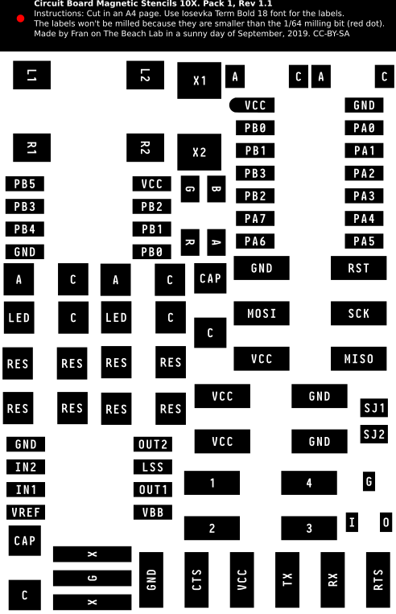

# circuits4kids

Circuits for Kids is a workflow to assist people with reduced fine motor skills -like (my) kids- to draw and fabricate their circuit boards. The idea is drawing the traces of the circuit board in a magnified canvas (tipically 10x) with magnetic repositionable SMD components.

1. [Materials and equipment needed](#materials-and-equipment-needed)
2. [Preparing the circuit canvas](#preparing-the-circuit-canvas)
3. [Preparing the the SMD components stencils](#preparing-the-the-smd-components-stencils)
4. [Fabricating the rectifiers](#fabricating-the-rectifiers)
5. [Drawing a circuit board](#drawing-a-circuit-board)
6. [Fabricating the circuit board](#fabricating-the-circuit-board)
7. [Tips and Tricks](#tips-and-tricks)

## Materials and equipment needed

- Flatbed scanner
- Vinyl cutter
- White vinyl
- 3D printer
- A small piece of 2mm thick EVA rubber. [Amazon link](https://amzn.to/2o64hry)
- Pack of 10 A4-sized magnetic sheets. [Amazon link](https://amzn.to/2oWivvD)
- Erasable marker around 4mm width tip [Amazon link](https://amzn.to/2nqXGYu)

## Preparing the circuit canvas

The circuit canvas will be one A4/A3 metal sheet with a layer of white vinyl. The circuits will be hand-drawn here with the erasable marker. Make sure that the erasable marker erases easily in your vinyl.

## Preparing the the SMD components stencils

On top of the magnetic canvas we will place the magnetic stencils with the different components. 

1. Download the A4 stencils from [here](10x.svg).
2. Cut it with the vinyl cutter. Use preferably 60 degree blade. If not try with the 45 degree. Otherwise hide the text layer.
3. Transfer the stencils on the mat (non magnetised) side of a new magnetic sheet.
4. Cut the magnetised sheet along the oulines of the components.
5. With a tweezer, carefully remove the pads of the vinyl, leaving the text in the magnetised sheet. Pads should be black, the rest white.

> **Please note:** The magnetic sheet has two sides. Only one of them is magnetised. The satin side is magnetised while the mat side is not magnetised. Place the white vinyl in the non-magnetised satin side of the magnetic sheet.

## Fabricating the rectifiers

The rectifiers are 3D printed parts with EVA foam that will erase the excess of thickness creating a clearance. Sort of a manual DCR. 

- FreeCAD parametric file (for editing purposes)
- STL files (for fabrication)
- 2D stencils (for cutting the EVA rubber)

## Drawing a circuit board

- Place the magnetic components on top of the canvas and use the marker to draw the traces.
- Draw an free-hand outline around your circuit. It will be used as the cutout line.

## Fabricating the circuit board

1. Scan the assembly (canvas with magnetic components and hand-drawn traces) with a flatbed scanner to png format.
2. Using [`mods`](https://github.com/fabfoundation/mods) or your favourite software mill the traces and cutout the outline of your circuit.
3. Stuff your components, program it (if needed) and you are ready to go!

## Tips and Tricks

If you want to place traces in between the pads use the 0.4 , 0.3, and 0.2 rectifiers to finely adjust the thickness of your hand drawn traces.
